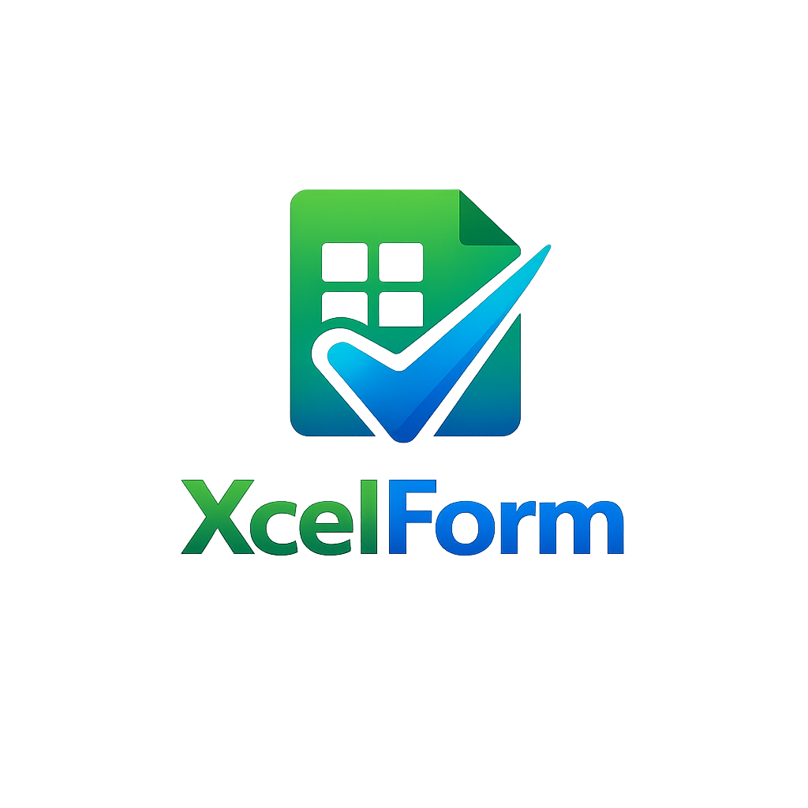

<p align="center">
  
</p>

<h2 align="center"></h2>

<p align="center">
<b>XcelForm</b> is a Frappe/ERPNext app that allows you to export data to Excel with custom formats and designs — just like print formats!
</p>

---

## 📢 **⚠️ Warning: Under Development!**
This app is currently **under development**.  
You are welcome to **test, explore, and contribute**! 🚀  

---

## 📚 **Features**
✅ Export any Doctype data into Excel with custom formats  
✅ Define multiple Excel templates for the same Doctype  
✅ Easy-to-use interface to create, manage, and apply Excel formats  
🧪 **Excel Preview feature** to test the format before export (**🔬 In Testing Stage**)  
✅ **Attach or Download Excel:** Option to attach Excel to the document or directly download it  

---

## ⚙️ **Installation**

```bash
# Get the app
bench get-app xcelform https://github.com/jezlan/xcelform.git

# Install on your site
bench --site your-site-name install-app xcelform
```

---

## 📝 **Usage**
1. Go to the respective Doctype.
2. Click on **XF Excel Format**.
3. Select the desired format.
4. Click **Preview** to test the format (currently in testing phase).
5. Choose whether to **attach** the file to the document or **download** it.
6. Export the customized Excel file!  

---

## ⚡️ **How It Works**
- **Excel Formats:** Define custom Excel formats in the **XF Excel Format** Doctype.
- **Excel Preview(🔬 Testing):** Allows users to preview the Excel layout and formatting before export.
- **Attach or Download:** Users can choose to attach the Excel file to the document or download it.  
- **Export Confirmation:** A success message appears when the file is attached or downloaded.  

---

## 🔧 **Configuring XF Settings for Excel Export**
To enable Excel export for a specific Doctype, follow these steps:  
1. Go to **XF Settings**.  
2. Add the desired Doctype in the **Doctypes Allowed for Export** section.  
3. Save the settings.  

✅ Now the selected Doctype can export Excel using **XcelForm**!  

---


## 🤝 **Contributing**
Contributions are welcome!  
Feel free to open issues or submit pull requests to improve the app.  

---

## 📄 **License**
This project is licensed under the MIT License.  
See the [LICENSE](./license.txt) file for more details.  

---
